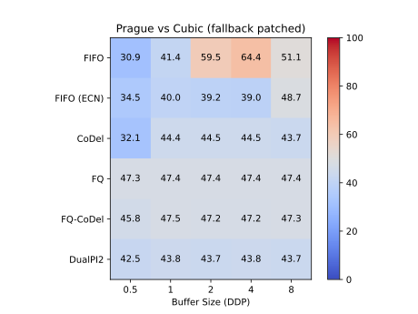

# Prague Fallback Experiments

TCP Prague is the candidate for scalable congestion control on the internet. A fallback to classic behavior was implemented to make sure that this new congestion control does not starve classic flows when competing on a classic ECN-capable AQM.

A recent experiment [1] has shown that the current implementation of this fallback falsely detects a new AQM as classic. This repo contains the experiment code I used to debug the issue. I have reproduced the results of [1] in Fig 1.

The fallback implementation contains two constant values, which are used as a reference for queuing delay and RTT variation (`V0_LG` and `D0_LG`). These values are upscaled by a factor `PRAGUE_MAX_ALPHA`, which was $2^{20}$ initially [2], but has changed afterwards. The values have not been adapted, which makes Prague fall back to classic behavior even on a scalable AQM.

To fix the issue, simply apply the patch `linux.diff` to the [L4S repo](https://github.com/L4STeam/linux/tree/testing), and recompile the kernel. Fig 2 displays the results of the experiment with the patch. Prague is now behaving as intended and not falling back to classic behavior.

## Images

Fig 1: Throughput of TCP Prague in Mbps competing with Cubic on a 100Mbps link.

Fig 2: Throughput of TCP Prague with the patch applied.

## Sources

[1] Sarpkaya, Fatih Berkay, et al. "To switch or not to switch to TCP Prague? Incentives for adoption in a partial L4S deployment." Proceedings of the 2024 Applied Networking Research Workshop. 2024.

[2] Briscoe, Bob, and Asad Sajjad Ahmed. "TCP Prague Fall-back on Detection of a Classic ECN AQM." arXiv preprint arXiv:1911.00710 (2019).
